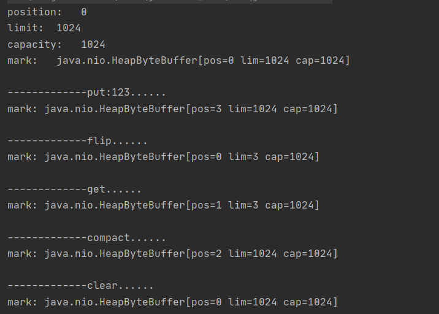
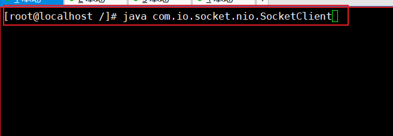

# IO实战

## 1.Page Cache 和页回写

### 1.1.Page Cache 是什么

>page cache:	页高速缓存是linux内核实现的磁盘缓存.是**通过把磁盘中的数据缓存到物理内存中,把对磁盘的访问变为对物理内存的访问,主要是用来减少对磁盘的I/O操作**.

### 1.2.Page Cache 的地位及原因

1. **地位**: page cache 在**任何**现代操作系统中都尤为重要
2. **原因**:
   - 访问磁盘的速度要远远低于访问内存的速度(ms 和 ns 的差距)
   - 数据一旦被访问,就有可能在短期内再次被访问到.(**局部性原理** p262)如果第一次访问数据就缓存它,那就极有可能在短期内再次被高速缓存命中,由于内存访问比磁盘快得多,所以磁盘的内存缓存 page cache 能给系统的存储性能带来质的飞跃!

### 1.3.写缓存的三种策略

1. nowrite(不缓存): 

   > 不缓存任何写操作

2. write-through cache(写透缓存): 

   >更新缓存,也更新磁盘文件

3. **回写**(linux采用) : 

   >p 263

正由于linux采用的第三种策略,才诞生本次的I/O学习

### 1.4.设置回写相关参数

```shell
# 查询,每个参数的意义,回写触发条件,回写暂停条件  p269
[root@localhost ~]# sysctl -a | grep dirty
vm.dirty_background_bytes = 0
vm.dirty_background_ratio = 10
vm.dirty_bytes = 0
vm.dirty_expire_centisecs = 3000
vm.dirty_ratio = 30
vm.dirty_writeback_centisecs = 500
```

在此处修改这些阈值


## 2.java的I/O对比

### 2.1.普通写

```java
// 最普通IO,每循环一次,都要触发系统调用 syscall(用户态切换到内核态) "123456789\n" 写入page cache
    public  void testBasicFileIO() throws IOException, InterruptedException {
        File file = new File(path);
        FileOutputStream out = new FileOutputStream(file);
        while(true){
            Thread.sleep(10);
            out.write(data);
        }
    }
```

>​	直接使用java文件输出流写,而且并没有调用flush,速度是很慢的, 写一段时间直接非正常关闭机器电源发现文件内容为0,也就是全部丢失.因为这段时间里写的内容都被page cache缓存了(上面设置了阈值10%),此时关闭虚拟机page cache的数据没来得及写进磁盘,所以全部丢失,如果写了超过了page cache的阈值,那么数据会被写进磁盘,因为到达阈值触发了写磁盘操作.

### 2.2.缓存写

```java
 // jvm 8KB 的缓冲区,满了,就触发系统调用 syscall ,减少了系统调用,效率提高
    public  void testBufferFileIO() throws IOException, InterruptedException {
        File file = new File(path);
        BufferedOutputStream bos = new BufferedOutputStream(new FileOutputStream(file));
        while (true){
            Thread.sleep(10);
            bos.write(data);
        }
    }
```

>​	使用BufferedOutputStream文件写,速度明显快于直接文件流写,在写的过程中,前面直接文件流写的page cache缓存的页会越来越小,逐渐被写入磁盘,而缓存写会占用越来越大的page cache,当达到阈值会写进磁盘.

**缓存流写比直接文件流写快的原因**:

​	直接文件流写是每调用一次write则将"123456789\n"这10个字节调用一次系统调用write写到page cache,而缓存流写是在JVM里开辟了一个8k 的内存缓冲区,当写满8k时再调用系统调用写到page cache,因为缓存流调用的系统调用次数少,用户态内核态切换次数少,所以要比直接写快的多.

**注:调用flush会强制把page cache脏页写到磁盘.**

### 2.3.NIO(ByteBuffer)

[测试代码](src/main/java/com/io/test/TestByteBuffer.java)

```java
 @Test
    public void testNio() {
        ByteBuffer buffer = ByteBuffer.allocate(1024); // 堆中分配缓冲区
        ByteBuffer directBuffer = ByteBuffer.allocateDirect(1024);  // 直接内存分配缓冲区

        System.out.println("position:\t" + buffer.position());
        System.out.println("limit:\t" +  buffer.limit());
        System.out.println("capacity:\t" + buffer.capacity());

        System.out.println("mark:\t" + buffer);
        System.out.println();

        System.out.println("-------------put:123......");
        buffer.put("123".getBytes());
        System.out.println("mark: " + buffer);
        System.out.println();

        System.out.println("-------------flip......");
        buffer.flip();   //读写交替
        System.out.println("mark: " + buffer);
        System.out.println();

        System.out.println("-------------get......");
        buffer.get();
        System.out.println("mark: " + buffer);
        System.out.println();

        System.out.println("-------------compact......");
        buffer.compact();
        System.out.println("mark: " + buffer);
        System.out.println();

        System.out.println("-------------clear......");
        buffer.clear();
        System.out.println("mark: " + buffer);
        System.out.println();
    }
```

输出结果:



- 缓冲区有三个指针,分别是postition,limit,capacity.初始情况：


- pos代表当前位置,limit主要用来记录位置,因为pos会移动,cap代表最大容量.起始时,pos指向起始位置,cap和limit都指向最大位置,当put(“123”)时,会向buffer中加入三个字节,所以pos向右移动了三个在3的位置

  

- 当调用buffer.flip()时代表读写交替,从写变为读,pos会移动到起始位置,因为要记录写到哪了,所以limit移动到pos的位置.

  

- 当调用buffer.get()时,从buffer中读出一个字节,所以pos会向右移动一个字节.

  

- 当调用buffer.compact()时会挤压一下,将已读的清除,将未读的向前挪动,然后pos回到写的位置,limit移动到最后,(当调用带索引的get(index)时,compact不会清除已读,会回到写的位置,limit移动到最后)

  

- buffer.clear()将buffer情况,回到起始位置.

  


### 2.4.NIO(File)

[测试代码（环境linux）](src/main/java/com/io/test/TestOSFileIO.java)

```java
 public static void testFileNio() throws IOException, InterruptedException {
        RandomAccessFile raf = new RandomAccessFile(path, "rw");

        // out.txt ===> hello RandomAccessFile
        raf.write("hello RandomAccessFile\n".getBytes());
        System.out.println("write------------");
        System.in.read();

        System.out.println("seek---------");
        raf.seek(4);
        // out.txt ===> hellooxxndomAccessFile
        raf.write("ooxx".getBytes());
        System.in.read();


        FileChannel rafchannel = raf.getChannel();
        //mmap  堆外  和文件映射的   byte  not  objtect
        MappedByteBuffer map = rafchannel.map(FileChannel.MapMode.READ_WRITE, 0, 4096);
        System.out.println("map--put--------");
        map.put("@@@".getBytes());  //不是系统调用  但是数据会到达 内核的pagecache
        System.in.read();
        /**
         * 曾经我们是需要out.write()  这样的系统调用，才能让程序的data 进入内核的pagecache
         * 曾经必须有用户态内核态切换
         * mmap的内存映射，依然是内核的pagecache体系所约束的！！！ 换言之，断电丢数据
         *
         * 你可以去github上找一些 其他C程序员写的jni扩展库，使用linux内核的Direct IO
         * 直接IO是忽略linux的pagecache
         * 是把pagecache  交给了程序自己开辟一个字节数组当作pagecache，动用代码逻辑来维护一致性/dirty。。。一系列复杂问题
         */

//        map.force(); //  等价于flush，只有flush了所有page cache上的内存数据才会写入磁盘

        raf.seek(0);

        ByteBuffer buffer = ByteBuffer.allocate(8192);
        rafchannel.read(buffer);   //等价 buffer.put()
        // java.nio.HeapByteBuffer[pos=4096 lim=8192 cap=8192]
        System.out.println(buffer);
        buffer.flip();
        //java.nio.HeapByteBuffer[pos=0 lim=4096 cap=8192]
        System.out.println(buffer);

        for (int i = 0; i < buffer.limit(); i++) {
            Thread.sleep(200);
            // @@@looxxndomAccessFile
            System.out.print(((char) buffer.get(i)));
        }
    }

```

>RandomAccessFile随机文件读写,与一般的文件读写不同点在于能够随时调整偏移,也就是seek().
>
>raf.getChannel()能拿到一个可读写的channel,而这个channel能够通过map()方法获取一个mmap的映射,能够直接进入page cache,且不经过系统调用.

### 2.5.io的几种内存分配位置

1. **on heap**:堆上分配,ByteBuffer.allocate(1024),在JVM的堆上分配一个缓冲区,写入时需要先复制到堆外内存,再从堆外复制到page cache,最后写到磁盘.

2. **off heap**:堆外分配（直接内存）,ByteBuffer.allocateDirect(1024);或者使用unsafe.allocateMemory();(unsafe的需要调用freeMemory()回收,ByteBuffer的GC好像能够回收)不在JVM的堆里,而是在Java进程的堆里(jvm的堆只是java堆的一块分配区域,根据参数-Xms和-Xmx决定,区别就是堆内可以直接存储对象,受GC管理,堆外只能使用字节数组,不受GC管理),它相对于jvm堆,少了一步复制到堆外的过程,直接复制到page cache再写到磁盘.

3. **mmap**:raf.getChannel().map(FileChannel.MapMode.READ_WRITE, 0, 4096)。使用RandomAccessFile获取channel可获取到一个mmap的映射缓冲区,直接对接page cache,不产生系统调用.

   

4. 性能：mmap > off heap > on heap

## 3.TCP与Socket

|                                              | 阻塞(读不到写不出时，代码卡在那) | 非阻塞（无论read/write成功与否都可以返回，执行后面代码） |
| -------------------------------------------- | -------------------------------- | -------------------------------------------------------- |
| **同步（app自己完成系统调用read/write）**    | Bio                              | Nio,select.poll,epoll                                    |
| **异步(kernel完成read/write,返回结果给app)** | 无                               | iocp(windows)，linux还没有                               |

### 3.1.Bio

在linux上做实验，深入理解TCP，socket

1. 将代码拷贝到linux,[Server代码](src/main/java/com/io/socket/bio/SocketIOPropertites.java)，[Client代码](src/main/java/com/io/socket/bio/SocketClient.java)

2. 编译我们的.java文件

   

3. 分别开启四个窗口方便我们查看

   - 客户端窗口

     

   - 服务端窗口

     

   - 监听9090端口上的包

     

   - 查看网络状态

     

4. 执行server端的窗口的指令，运行我们的java程序

   

   再次观察我们的网络状态

   

   查看我们5220进程的文件标识符的状态

   

5. 执行client端的窗口的指令，运行我们的java程序

   

   查看9090端口的抓包情况

   

   再次观察我们的网络状况

   

6. 尝试在客户端向服务端发送数据

   

   查看抓包情况

   

   查看网络状态

   

   查看文件标识符

   

7. 查看我们的服务端

   

   放开我们server端的accept()之前的阻塞

   

   查看网络状态

   

   查看文件标识符

   

8. 当我开启多个client时，使用netstat  -natp 查看网络状态，只能有1+2(**配置了： backlog=2**)个socket建立，只要前面的3个连接没断开，再来多少个客户端的socket都无法在内核建立，完成三次握手，和分配资源。

9. 实验结束！！！

#### 3.1.1.实验总结

1. tcp在我们的文件标识符FD分配之前，即accept()调用之前，其实在内核已经建立连接，socket四元组已经创建好了，buffer资源已经分配。

2. 只要四元组（Server IP ,Server Port , Client IP, Client Port）有任何一个维度不一样，我们的socket就可以建立

3. 服务端不需要为每个client分配一个随机端口号，所以只要socket四元组唯一，就能确定哪两个进程在通讯，几百万个客户端连接都没问题

4. 一个进程可以监听多个端口号

   


#### 3.1.2.Socket在内核建立过程

上面的Server端的代码，在内核级别的过程：


**发现每来一个client的连接，Server（或者主线程main）分配不同的fd,新new Thread去拿着分配到的fd去内核的socket四元组的buffer接收数据和发送数据**

### 3.2.Nio

[c10K问题](http://www.kegel.com/c10k.html)

```
描述： 随着互联网的普及，应用的用户群体几何倍增长，此时服务器性能问题就出现。最初的服务器是基于进程/线程模型。新到来一个TCP连接，就需要分配一个进程。假如有C10K，就需要创建1W个进程，可想而知单机是无法承受的。那么如何突破单机性能是高性能网络编程必须要面对的问题，进而这些局限和问题就统称为C10K问题，最早是由Dan Kegel进行归纳和总结的，并且他也系统的分析和提出解决方案。

```

>解决方案：
>
>1. 每个连接分配一个独立的线程/进程（Bio 多线程）
>2. 同一个线程/进程同时处理多个连接  （Nio）

[nio代码](src/main/java/com/io/socket/nio/SocketNIO.java)

#### 3.2.1.Nio的优缺点

优点：

```
使用一个或几个线程解决了N个IO连接
```

缺点：

```
在读取recv数据的时候是遍历，很有可能众多连接中只有1到2个buffer中有数据，做了无用功，而且每次读取buffer都是系统调用，有用户态向内核态的切换，效率低
```

#### 3.2.2.多路复用器(select,poll)

为了解决上面的Nio的遍历导致时间复杂度O(N)的系统调用,诞生了多路复用器

多路复用器:

>把所有的socket连接的文件标识符FD传给内核,内核去遍历, 返回给app哪些文件标识符可以read或者write的I/O操作,此处只触发了一次用户态到内核态的系统调用,而且还解决了上面遍历导致的没有数据需要读写但还是有系统调用做的无用功

#### 3.2.3.多路复用器升级版(epoll)

为了解决select和poll每次都要重复传文件标识符fd给内核,内核针对这个调用最终还会遍历全量fd,由此诞生了epoll

epoll:

>1. server在监听socket建立时就会触发epoll_create的系统调用,创建一个文件标识符为fd6的区域(红黑树)去存储我们的所有当前进程的fd,和有状态的fd的链表
>2. 调用epoll_ctl把我们的key: fd4   value:accpet(状态) 添加到红黑树中
>3. 客户端来通过中断创建了一个连接,分配了一个fd7,内核会重复1.2步把fd7添加到红黑树中
>4. 客户端fd7发送了一些数据,内核中断响应后,会把红黑树中fd7的状态改为read,并把fd7 copy到链表中
>5. server调用epoll时,会触发epoll_wait去链表中拿有状态的fd7,并通过系统调用中断去read/write数据,与此同时内核会更新fd7的状态
>6. 做到epool_wait不存在遍历行为,不用重复传递fd


